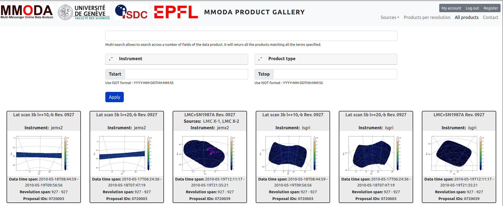
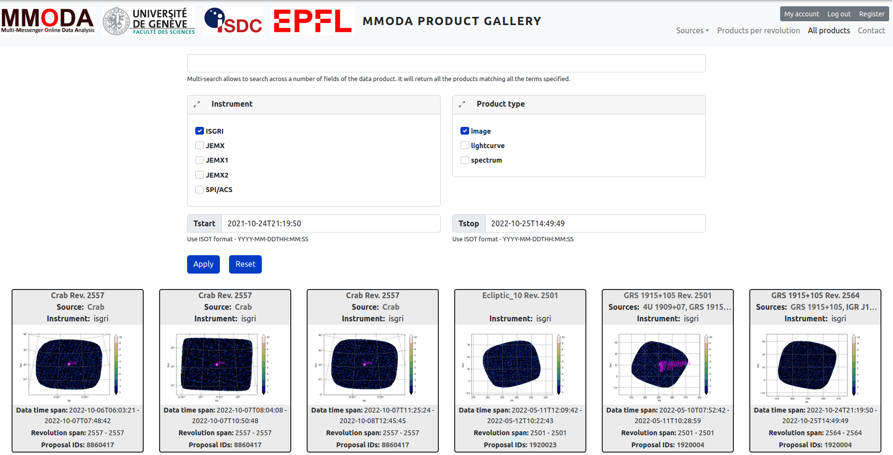
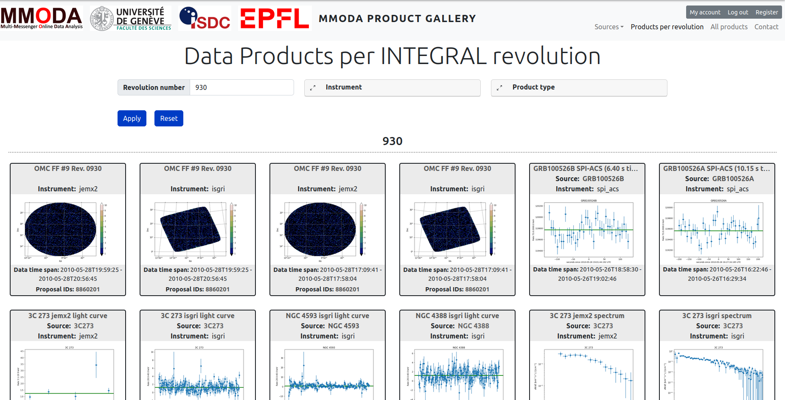
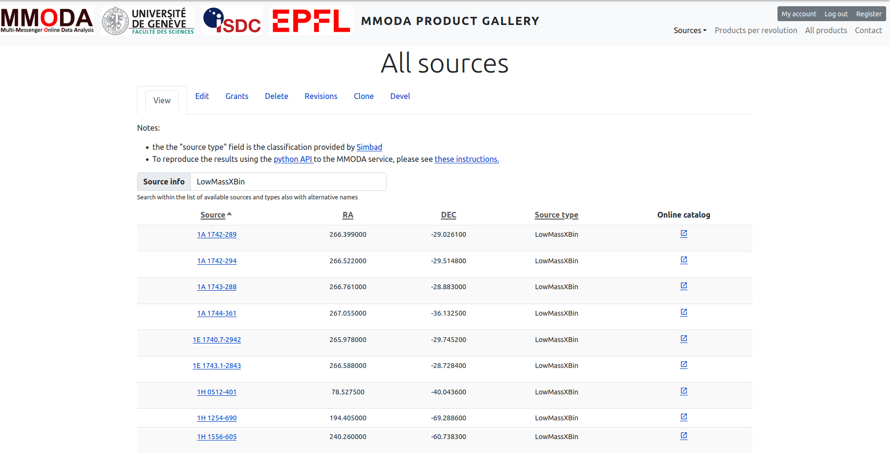

# A Gallery of INTEGRAL products through the MultiMessenger Online Data Analysis

## A Collection of high-level products ​

* Products can be explored and downloaded​
* IBIS/ISGRI, JEM-X and SPI/ACS instruments currently available​
* Hosted on a Drupal-powered website ​
* Dedicate RESTful-API endpoints for automatized content creation and editing

## Products can be searched​

* Per __instrument__: ISGRI, JEM-X1, JEM-X2, JEM-X, SPI/ACS.​
* Per __type of product__: spectrum, light curve, image​
* Per __observing period__: specify start and end time​

## Products per revolution​

Data are processed per observation within the satellite revolution​, making the products easily searchable per satellite revolution​.

​

## Sources

Every source that is detected within at least a single observation appears in the Gallery​. Those can be searched based on their name(s) as well as per class (e.g. all <i>LowMassXBin</i>​).

